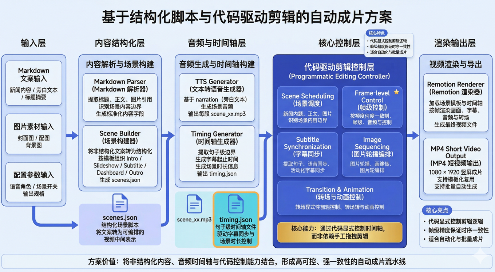

<p align="center">
  
</p>

<h1 align="center">Briefing Video</h1>

<p align="center">
  <b>政务/产业新闻简报短视频自动生成工具</b>
</p>

<p align="center">
  将 Markdown 格式的新闻文本转换为 60-120 秒专业短视频，全程无需剪辑软件。
</p>

<p align="center">
  <a href="https://github.com/itxaiohanglover/briefing-video/blob/main/LICENSE">
    
  </a>
  <a href="https://www.remotion.dev/">
    
  </a>
</p>

---

## 架构图

<p align="center">
  
</p>

---

## 安装

```bash
npx add itxaiohanglover/briefing-video
```

## 特性

- 🎙️ **音频优先** - Edge TTS 驱动，音画自动同步
- 📱 **竖屏优化** - 1080×1920，适合视频号/抖音/快手
- 🎬 **5场景模板** - Intro → Slideshow → Subtitle → Dashboard → Outro
- 📝 **精确字幕** - 基于音频时间轴的按句字幕同步
- 📊 **数据可视化** - 支持数据卡片 + 可选产业链流程
- 🎨 **统一配色** - 深蓝暗色系 + 红粉强调色 

## 工作流

```
┌─────────────┐     ┌─────────────┐     ┌─────────────┐     ┌─────────────┐
│  Markdown   │ ──▶ │  scenes.json │ ──▶ │  Edge TTS   │ ──▶ │   Remotion  │
│   + 图片    │     │   场景配置   │     │ 音频+时间轴 │     │    渲染     │
└─────────────┘     └─────────────┘     └─────────────┘     └─────────────┘
                                                                  │
                                                                  ▼
                                                           ┌─────────────┐
                                                           │   MP4 视频  │
                                                           └─────────────┘
```

## 命令

| 命令 | 说明 |
|------|------|
| `/briefing-video init` | 初始化项目结构 |
| `/briefing-video build` | 完整构建（解析→音频→渲染）|
| `/briefing-video parse` | 仅解析 Markdown → scenes.json |
| `/briefing-video audio` | 仅生成音频 + timing.json |
| `/briefing-video render` | 仅渲染视频 |

## 目录结构

```
my-project/
├── input/
│   └── news.md           # 原始新闻文档
├── images/               # 配图素材
├── content/              # AI 切分后的场景 Markdown
├── scenes.json           # 场景配置
├── scripts/
│   └── generate_audio.py # Edge TTS 音频生成
├── public/
│   └── audio/
│       ├── background.mp3    # 背景音乐
│       ├── timing.json       # 字幕时间轴
│       └── scene_*.mp3       # 各场景配音
├── src/
│   ├── scenes/           # 5 个场景组件
│   ├── components/       # 共享组件
│   └── Root.tsx          # 视频根组件
└── out/
    └── video.mp4         # 输出视频
```

## 技术栈

- [Remotion](https://www.remotion.dev/) - React 视频框架
- [Edge TTS](https://github.com/rany2/edge-tts) - 微软 Edge 语音合成
- TypeScript / Python

## 许可证

MIT License - 详见 [LICENSE](LICENSE)
